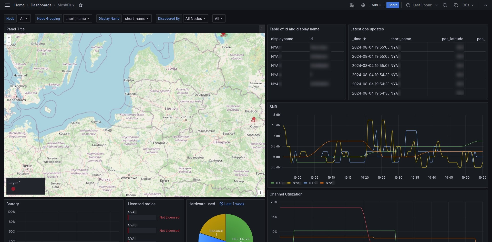

## What is it
Basically
- Reads data from Meshtastic device
- Formats data
- Sends to InfluxDB

But also
- Allows multiple devices to send info and filter based on it
- Group devices by name, mac and hardware

## What it monitors
- Everything in nodes tab

## Why
MQTT isn't meant for long term storage and it's harder to visualize

## Setup
- Make sure you have a 
  - Working python install (tested 3.12.3)
    - And required modules (pip install -r requirements.txt)
  - InfluxDB v2
    - With a bucket and token
  - Grafana (and InfluxDB as data source)
- Rename env.py.example to env.py and fill in
- Import Grafana dashboard (you also need official GeoMap plugin)
- Run and wait for data

or skip having a python install and use a docker container
- git clone https://github.com/lameslime/meshflux
- copy env.py.example to env.py and fill in
- docker compose up --build -d

## Note
It is confirmed working with RAK4631 using PoE and Heltec V3 using wifi  
You can edit cmd variable to use bt or usb instead, multiple Meshtastic devices should still work

## License
Use it as you want, but I'd like to be listed in credits

## Credits
Dmitri Prigojev for inspiration
https://github.com/dmitripr/meshtastic_InfluxDB