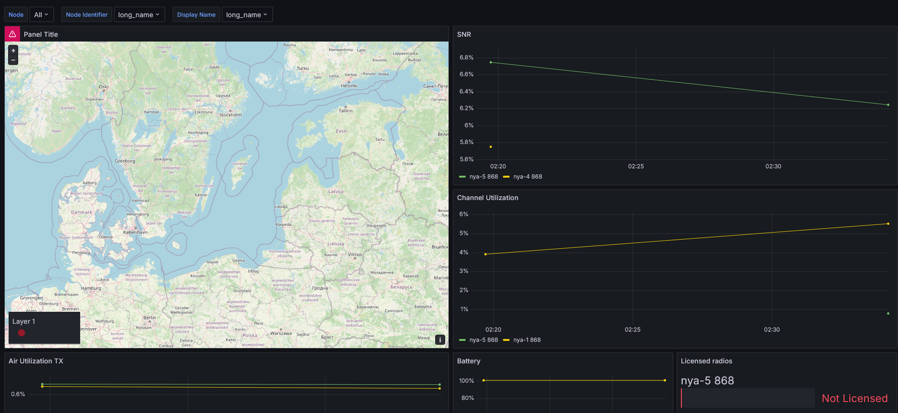

## What is it
Basically
- Reads data from Meshtastic device
- Formats data
- Sends to InfluxDB

But also
- Allows multiple devices to send info and filter based on it
- Group devices by name, mac and hardware

## What it monitors
- Everything in nodes tab

## Why
MQTT isn't meant for long term storage and it's harder to visualize

## Setup
- Make sure you have a 
  - Working python install (tested 3.12.3)
    - And required modules (pip install -r requirements.txt)
  - InfluxDB v2
    - With a bucket and token
  - Grafana (and InfluxDB as data source)
- Rename env.py.example to env.py and fill in
- Possibly edit cmd variable in get_meshtastic_data function (main.py)
- Import Grafana dashboard (you also need official GeoMap plugin)
- Run and wait for data

## Note
I happened to make it on Windows, there should be no problems on linux (check cmd variable)

It is confirmed working with RAK4631 using PoE, you can edit cmd variable to use bt or usb

## TODO
- Docker image
- Done: Hopefully have a heatmap layer on map displaying signal strength
- Done: INCLUDE_DISCOVERED_BY functionality in grafana
If enabled then it will create duplicate names in 'basic' queries, because if you use multiple nodes to ingest data to the same bucket fields will be different.
Additinal logic will be needed in flux queries, to ignore/filter based on ingestors id.
- Done: Error handling (Meshtasic and InfluxDB timeouts); Super basic 3 tries and still continues
- Done: Multiple Meshtastic nodes (currently you need more python instances)
- Done: Data deduplication (GPS data gets outdated fast)

## Credits
Dmitri Prigojev for inspiration
https://github.com/dmitripr/meshtastic_InfluxDB

## License
Use it as you want, but I'd like to be listed in credits
